# Plano de Execução — market-dashboard

## Resumo da Análise Detalhada

### Escopo de Transformação
- **Tipo**: Greenfield (sistema novo)
- **Mudanças principais**: BFF FastAPI + Valkey + indicadores; frontend Angular; Terraform AWS
- **Componentes relacionados**: CoinGecko (externo), Docker Compose (local), ElastiCache/ECS/ALB/S3/CloudFront (AWS)

### Avaliação de Impacto
| Área | Impacto |
|---|---|
| Mudanças voltadas ao usuário | Sim — painel web com tabela de indicadores |
| Mudanças estruturais | Sim — arquitetura BFF + cache + FE + IaC |
| Modelo de dados | Sim — payloads de indicadores e chaves de cache (sem DB relacional) |
| Mudanças de API | Sim — endpoints do BFF consumidos pelo Angular |
| Impacto de NFR | Sim — TTL/cache, degradação, PBT, custo AWS |

### Avaliação de Risco
- **Nível de risco**: Médio
- **Complexidade de rollback**: Moderada (greenfield; infra AWS exige `destroy`)
- **Complexidade de teste**: Moderada (unitário + PBT em indicadores + testes manuais de integração local)

### Unidades previstas (alinhadas a RF-07 / histórias)
1. **U1 — BFF + Valkey local + indicadores** (US-BFF-01…06)
2. **U2 — Frontend Angular** (US-FE-01…03)
3. **U3 — Infra Terraform AWS** (US-INF-01…04)

---

## Visualização do Fluxo

### Diagrama Mermaid

```mermaid
flowchart TD
    Start(["Pedido do Usuario"])

    subgraph INCEPTION["INCEPTION"]
        WD["Deteccao Workspace<br/>COMPLETED"]
        RE["Engenharia Reversa<br/>SKIP"]
        RA["Analise Requisitos<br/>COMPLETED"]
        US["Historias de Usuario<br/>COMPLETED"]
        WP["Planejamento Fluxo<br/>IN_PROGRESS"]
        AD["Design Aplicacao<br/>EXECUTE"]
        UG["Geracao Unidades<br/>EXECUTE"]
    end

    subgraph CONSTRUCTION["CONSTRUCTION"]
        FD["Design Funcional<br/>EXECUTE_por_unidade"]
        NFRA["NFR Requisitos<br/>EXECUTE_por_unidade"]
        NFRD["NFR Design<br/>EXECUTE_por_unidade"]
        ID["Design Infra<br/>EXECUTE_seletivo"]
        CG["Geracao Codigo<br/>EXECUTE"]
        BT["Build e Testes<br/>EXECUTE"]
    end

    subgraph OPERATIONS["OPERATIONS"]
        OPS["Operacoes<br/>PLACEHOLDER"]
    end

    Start --> WD
    WD --> RE
    RE --> RA
    WD --> RA
    RA --> US
    US --> WP
    WP --> AD
    AD --> UG
    UG --> FD
    FD --> NFRA
    NFRA --> NFRD
    NFRD --> ID
    ID --> CG
    FD -.-> CG
    CG -->|Proxima unidade| FD
    CG --> BT
    BT -.-> OPS
    BT --> EndNode(["Completo"])

    style WD fill:#4CAF50,stroke:#1B5E20,stroke-width:3px,color:#fff
    style RA fill:#4CAF50,stroke:#1B5E20,stroke-width:3px,color:#fff
    style US fill:#4CAF50,stroke:#1B5E20,stroke-width:3px,color:#fff
    style WP fill:#4CAF50,stroke:#1B5E20,stroke-width:3px,color:#fff
    style CG fill:#4CAF50,stroke:#1B5E20,stroke-width:3px,color:#fff
    style BT fill:#4CAF50,stroke:#1B5E20,stroke-width:3px,color:#fff
    style RE fill:#BDBDBD,stroke:#424242,stroke-width:2px,stroke-dasharray: 5 5,color:#000
    style AD fill:#FFA726,stroke:#E65100,stroke-width:3px,stroke-dasharray: 5 5,color:#000
    style UG fill:#FFA726,stroke:#E65100,stroke-width:3px,stroke-dasharray: 5 5,color:#000
    style FD fill:#FFA726,stroke:#E65100,stroke-width:3px,stroke-dasharray: 5 5,color:#000
    style NFRA fill:#FFA726,stroke:#E65100,stroke-width:3px,stroke-dasharray: 5 5,color:#000
    style NFRD fill:#FFA726,stroke:#E65100,stroke-width:3px,stroke-dasharray: 5 5,color:#000
    style ID fill:#FFA726,stroke:#E65100,stroke-width:3px,stroke-dasharray: 5 5,color:#000
    style OPS fill:#BDBDBD,stroke:#424242,stroke-width:2px,stroke-dasharray: 5 5,color:#000
    style Start fill:#CE93D8,stroke:#6A1B9A,stroke-width:3px,color:#000
    style EndNode fill:#CE93D8,stroke:#6A1B9A,stroke-width:3px,color:#000
    style INCEPTION fill:#BBDEFB,stroke:#1565C0,stroke-width:3px,color:#000
    style CONSTRUCTION fill:#C8E6C9,stroke:#2E7D32,stroke-width:3px,color:#000
    style OPERATIONS fill:#FFF59D,stroke:#F57F17,stroke-width:3px,color:#000
```



### Alternativa textual

```text
INCEPTION
- Deteccao Workspace .......... COMPLETED
- Engenharia Reversa .......... SKIP (greenfield)
- Analise de Requisitos ....... COMPLETED
- Historias de Usuario ........ COMPLETED
- Planejamento do Fluxo ....... IN PROGRESS (este documento)
- Design da Aplicacao ......... EXECUTE
- Geracao de Unidades ......... EXECUTE

CONSTRUCTION (por unidade U1 -> U2 -> U3)
- Design Funcional ............ EXECUTE seletivo (forte em U1)
- NFR Requisitos .............. EXECUTE seletivo (U1 e U3)
- NFR Design .................. EXECUTE onde NFRA executar
- Design de Infra ............. EXECUTE em U3; SKIP em U1/U2
- Geracao de Codigo ........... EXECUTE (sempre)
- Build e Testes .............. EXECUTE (sempre, apos unidades)

OPERATIONS
- Operacoes ................... PLACEHOLDER
```

---

## Estágios a Executar / Pular

### 🔵 INCEPTION
- [x] Detecção do Workspace — COMPLETED
- [x] Engenharia Reversa — SKIP (greenfield)
- [x] Análise de Requisitos — COMPLETED
- [x] Histórias de Usuário — COMPLETED
- [x] Planejamento do Fluxo — IN PROGRESS
- [ ] Design da Aplicação — **EXECUTE**
  - **Razão**: Novos componentes (rotas BFF, services, Angular, módulos Terraform) e contratos entre eles
- [ ] Geração de Unidades — **EXECUTE**
  - **Razão**: Três unidades de trabalho distintas (BFF, Frontend, Infra) com dependências e mapa de histórias

### 🟢 CONSTRUCTION (por unidade)
- [ ] Design Funcional — **EXECUTE seletivo**
  - **U1 BFF**: EXECUTE (indicadores, cache, degradação, contratos de API)
  - **U2 Frontend**: SKIP ou mínimo (UI de apresentação sem regras de negócio)
  - **U3 Infra**: SKIP (sem lógica de negócio de domínio)
- [ ] NFR Requisitos — **EXECUTE seletivo**
  - **U1**: EXECUTE (PBT, TTL/cache, timeouts CoinGecko)
  - **U2**: SKIP ou mínimo (environment, UX básica de erro)
  - **U3**: EXECUTE (custo, sizing, outputs, região)
- [ ] NFR Design — **EXECUTE** onde NFR Requisitos executar
- [ ] Design de Infraestrutura — **EXECUTE seletivo**
  - **U1/U2**: SKIP (Compose já definido nos requisitos; cloud na U3)
  - **U3**: EXECUTE (VPC, ElastiCache, ECS/ALB, S3/CloudFront)
- [ ] Geração de Código — **EXECUTE** (sempre; plano curto + OK antes de implementar)
- [ ] Build e Testes — **EXECUTE** (sempre)

### 🟡 OPERATIONS
- [ ] Operações — PLACEHOLDER

---

## Sequência de Unidades

```text
U1 BFF (+ Compose/Valkey/indicadores)
        |
        v
U2 Frontend Angular
        |
        v
U3 Infra Terraform AWS
        |
        v
Build e Testes (consolidado)
```

**Regras de interação (todas as unidades)**
- Plano curto da unidade + OK antes de código
- Implementar apenas a história/unidade atual
- Ao fim: listar arquivos + teste manual
- Em U3: mostrar `terraform plan` esperado antes de sugerir `apply`; lembrar `terraform destroy`

---

## Extensões
| Extensão | Status | Efeito no plano |
|---|---|---|
| Security Baseline | Desabilitada | Não bloqueia estágios |
| Resiliency Baseline | Desabilitada | RF-04 (degradação) permanece como requisito funcional |
| Property-Based Testing | Habilitada (completo) | Obrigatória em Design Funcional / Code Gen da U1 (indicadores) |

---

## Estimativa
- **Estágios Inception restantes**: 2 (Design + Unidades)
- **Unidades de construção**: 3 + Build/Test
- **Duração relativa**: média (estudo; sem autenticação; tiers baratos)

## Critérios de Sucesso
- Design e unidades aprovados antes da construção
- U1 entrega API de indicadores com cache/degradação + Compose
- U2 entrega tabela Angular + atualizar
- U3 entrega Terraform mínimo com outputs ALB/CDN
- PBT aplicado aos cálculos de indicadores
- Documentação AI-DLC em português
