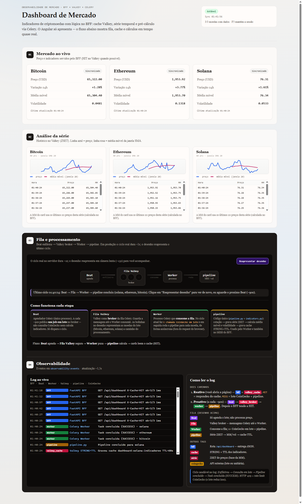
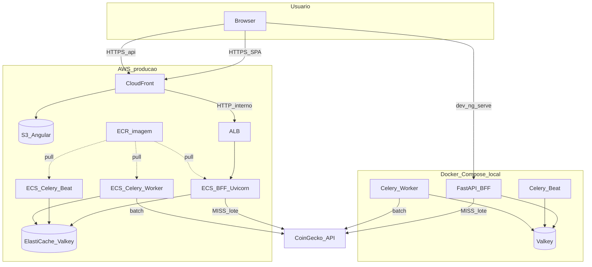

# Market Dashboard

Painel de mercado de criptomoedas: o Angular **só apresenta** dados.  
Coleta, série temporal, média móvel e volatilidade ficam no **BFF** (FastAPI). O **Valkey** concentra cache, ZSET de preços, broker do Celery e o log didático.  
Há dois ambientes: **local** (Docker Compose) e **AWS** (Terraform: CloudFront → ALB → Fargate → ElastiCache).



*Captura da SPA em produção: (01) mercado ao vivo, (02) série no Valkey, (03) desenho Beat → Fila → Worker → pipeline, (04) log de observabilidade.*

## Objetivo do projeto

| Objetivo | Como |
|----------|------|
| Ver indicadores sem poluir o browser | Cálculos só no BFF (`pipeline` + `indicators`) |
| Resposta rápida | Cache-aside no Valkey + pré-cálculo com Celery Beat |
| Uma única lógica de coleta | `pipeline.py` na rota MISS e na task do Worker |
| Evitar 429 da CoinGecko | **Uma** task batch + 1 chamada HTTP para todas as moedas + rate-gate |
| Enxergar o fluxo (estudo) | UI didática + `GET /api/observability/events` |
| Estudo na AWS com custo controlado | Fargate sem NAT; Valkey `t4g.micro`; `terraform destroy` ao fim |

## O que a UI mostra

| Bloco | Conteúdo |
|-------|----------|
| **01 Mercado ao vivo** | Cards BTC / ETH / SOL (preço, var. 24h, MM, volatilidade). Soft refresh — cards não somem no F5 |
| **02 Análise da série** | Sparkline + tabela (`GET /api/series/{moeda}`) a partir do ZSET no Valkey |
| **03 Fila e processamento** | Animação em câmera lenta do ciclo Beat → Fila Valkey → Worker → pipeline. Botão **Reapresentar desenho** só repete o desenho (não enfileira task) |
| **04 Observabilidade** | Log ao vivo (polling) + legenda HIT/MISS vs ciclo proativo |

## Arquitetura

### Visão geral (Mermaid)



### Alternativa em texto

```text
PRODUCAO (AWS)
  Browser -> CloudFront (SPA no S3 + proxy /api e /health)
         -> ALB -> ECS BFF (Uvicorn)
                -> ElastiCache Valkey (cache + serie + broker + observability)
         Celery Beat (1 task: processar_dashboard_batch, ~90s)
           -> fila no Valkey -> Worker -> pipeline (1 HTTP CoinGecko para N moedas)

LOCAL (Compose)
  Browser -> Angular :4200 -> BFF :8000 -> Valkey
  Beat + Worker (mesma imagem) usam o mesmo pipeline.py
```

### Fluxos de atualização

| Modelo | Quem dispara | Caminho | Resultado típico |
|--------|--------------|---------|------------------|
| Reativo | Usuário (Angular) | BFF lê cache; misses entram em `processar_moedas` (lote) | HIT se cache quente; MISS + 1 chamada CoinGecko se frio ou `?refresh=true` |
| Proativo | Celery Beat | Agenda `tasks.processar_dashboard_batch` → Worker → pipeline | Cache pré-aquecido → dashboard majoritariamente HIT |

### Contratos da API

| Método | Rota | Uso |
|--------|------|-----|
| `GET` | `/api/dashboard` | Lista de cards + header `X-Cache: HIT\|MISS` |
| `GET` | `/api/dashboard?refresh=true` | Força reprocessamento (lote) |
| `GET` | `/api/series/{moeda}?limit=40` | Pontos da série + MM por ponto (cálculo no BFF) |
| `GET` | `/api/observability/events?limit=50` | Eventos didáticos (LIST no Valkey) |
| `GET` | `/health` | Health check ALB / Compose |

Campos do card (`/api/dashboard`): `moeda`, `preco`, `variacao_24h`, `media_movel`, `volatilidade`, `atualizado_em`.

## Aplicabilidade de cada tecnologia

### Aplicação (local e cloud)

| Tecnologia | Papel neste projeto | Por que se aplica |
|------------|--------------------|-------------------|
| **Angular** | SPA; cards, série, fila didática, log | UI tipada; zero cálculo de indicador no browser |
| **TypeScript / HttpClient** | `DashboardService`, `SerieService`, `ObservabilityService` | Contratos alinhados às rotas do BFF |
| **UiSnapshotService** | `sessionStorage` — restaura cards no F5 | Soft refresh sem “piscar” vazio |
| **environment / environment.prod** | `apiBaseUrl` local vs CloudFront | Dev em `:8000`; prod na mesma origem HTTPS do CDN |
| **FastAPI (BFF)** | HIT/MISS, série, observabilidade, CORS, `X-Cache` | Não expõe CoinGecko/Valkey ao frontend |
| **Uvicorn** | Servidor ASGI do BFF | Runtime no Compose e nas tasks Fargate |
| **pipeline.py** | Coleta → série → indicadores → cache | Rota MISS e task Celery compartilham a mesma lógica |
| **indicators.py** | Média móvel e volatilidade | Regras de negócio isoladas do cache e do HTTP |
| **CoinGecko API** | Preço e variação 24h (`get_market_data_many`) | Fonte pública keyless; 1 request para N moedas |
| **httpx** | Cliente HTTP + retry em 429 | Timeouts e backoff sem derrubar o app |
| **Valkey** | Cache STRING+TTL, série ZSET, broker, LIST de eventos | Um store em memória para latência e fila |
| **Celery Worker** | Executa `processar_dashboard_batch` | Pré-cálculo assíncrono desacoplado do request |
| **Celery Beat** | Agenda 1 task a cada `BEAT_INTERVAL_SECONDS` (default 90) | Um processo só — dois beats duplicariam o schedule |
| **Docker / Compose** | `valkey` + `backend` + `worker` + `beat` | Dev local espelhando os três papéis do Fargate |

### Infraestrutura AWS (Terraform em `infra/`)

| Tecnologia | Papel neste projeto | Por que se aplica |
|------------|--------------------|-------------------|
| **Terraform** | Rede, ECR, Valkey, ECS, S3, CloudFront | Infra como código, reproduzível e destruível |
| **VPC + subnets** | Pública (Fargate/ALB) e privada (ElastiCache) | Estudo sem NAT Gateway |
| **ECR** | Imagem única do backend | Mesma imagem para BFF, worker e beat |
| **ElastiCache for Valkey** | Cache / série / broker / observability | Produção sem administrar VM |
| **ECS Fargate** | Três serviços: BFF, worker, beat | Beat com `desired_count=1` |
| **ALB** | Entrada HTTP do BFF | Health check `/health` |
| **S3 + CloudFront + OAC** | SPA + proxy `/api/*` e `/health` → ALB | HTTPS; evita mixed content |
| **CloudWatch Logs** | `/ecs/.../bff\|worker\|beat` | Logs das tasks |

Detalhes de apply/push/sync: [`infra/README.md`](infra/README.md).

## Estrutura do repositório

```text
market-dashboard/
  docs/                  # Print da UI (README)
  frontend/              # Angular (cards, série, fila, observabilidade)
  backend/               # FastAPI, pipeline, Celery, Dockerfile
  infra/                 # Terraform (H14–H19)
  docker-compose.yml     # Valkey + BFF + worker + beat
```

## Subir o ambiente local

```bash
docker compose up -d --build
```

Sobe: `valkey`, `backend` (:8000), `worker`, `beat`.

```bash
cd frontend
# Angular 19: preferir Node 20 LTS (ex.: nvm use 20.11.1)
npm start
```

Abra `http://localhost:4200`. A API local é `http://localhost:8000`.

Se `ng serve` crashar com `Assertion failed` / `spawn UNKNOWN` (comum em alguns Node 22): troque para Node 20, apague `node_modules` e `.angular`, rode `npm install` de novo.

Se aparecer `JS heap out of memory` no Vite: feche outros `node`/`ng serve`, limpe `.angular`, e use `npm start` (já sobe com `--max-old-space-size=8192`). Evite duas instâncias ao mesmo tempo.

## Produção na AWS (resumo)

1. `cd infra` → `terraform plan` → `terraform apply`
2. Build/push da imagem do backend para o ECR
3. Force deploy dos serviços ECS (`bff`, `worker`, `beat`)
4. `ng build` → `aws s3 sync dist/frontend/browser` → invalidação CloudFront
5. Abrir `terraform output cloudfront_url`

Em produção o Angular chama a API no **mesmo domínio** do CloudFront; o CDN encaminha `/api/*` ao ALB.

**Custo contínuo** enquanto a stack existir. Ao fim da sessão de estudo:

```bash
cd infra
terraform destroy
```

## Rate limit CoinGecko

API pública keyless ≈ 10–50 req/min. Este projeto reduz pressão assim:

| Mecanismo | Default | Efeito |
|-----------|---------|--------|
| Task única `processar_dashboard_batch` | a cada **90 s** | Não dispara 3 tasks paralelas |
| `get_market_data_many` | 1 HTTP / ciclo | Todas as moedas no mesmo request |
| `COINGECKO_MIN_INTERVAL_SECONDS` | **2.5** | Rate-gate no Valkey entre chamadas |
| Retry em HTTP 429 | backoff | Evita cascata de falhas |
| `CACHE_TTL_SECONDS` | **90** | Alinha TTL ao intervalo do Beat |

Ajuste via env: `BEAT_INTERVAL_SECONDS`, `CACHE_TTL_SECONDS`, `DASHBOARD_COIN_IDS`, `COINGECKO_MIN_INTERVAL_SECONDS`.

## Observabilidade didática

Eventos em LIST do Valkey (`observability:events`), expostos em `GET /api/observability/events`.

| Fonte | Tecnologia |
|-------|------------|
| `bff` | FastAPI — HIT/MISS da rota |
| `beat` | Celery Beat enfileirando o batch |
| `worker` | Celery Worker consumindo a fila |
| `valkey_broker` / `valkey_cache` / `valkey_serie` | Broker, cache STRING+TTL, ZSET |
| `pipeline` / `coingecko` | Coleta e cálculo (não no browser) |

O desenho da fila na UI **replay** o último ciclo em câmera lenta (~15–18 s), porque o ciclo real costuma ser ~1 s. O botão **Reapresentar desenho** só reanima; não chama a CoinGecko.

```bash
curl -s "http://localhost:8000/api/observability/events?limit=20"
curl -s "http://localhost:8000/api/series/bitcoin?limit=10"
```

## Checagens rápidas

Local:

```bash
curl -i http://localhost:8000/api/dashboard
curl -s "http://localhost:8000/api/series/bitcoin?limit=5"
curl -s "http://localhost:8000/api/observability/events?limit=10"
docker compose logs beat --tail 30
docker compose logs worker --tail 30
```

AWS (após apply):

```powershell
curl.exe -i "http://$(terraform "-chdir=infra" output -raw alb_dns_name)/api/dashboard"
curl.exe -i "https://$(terraform "-chdir=infra" output -raw cloudfront_domain_name)/api/dashboard"
```
