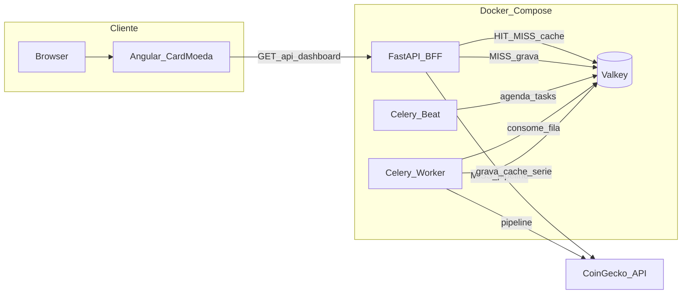

# Market Dashboard (local)

Stack: Angular + FastAPI (BFF) + Valkey + Celery (worker + beat) + CoinGecko.

## Arquitetura

### Diagrama (Mermaid)



### Alternativa em texto

```text
Browser -> Angular (CardMoeda)
       -> HTTP GET /api/dashboard
       -> FastAPI BFF
            |-- HIT  -> Valkey (cache indicadores)
            |-- MISS -> pipeline -> CoinGecko
            |                 -> Valkey (serie + cache)

Celery Beat (1 processo) -> agenda tasks no Valkey (broker)
Celery Worker            -> consome fila -> mesmo pipeline -> Valkey
```

### Fluxos

| Modelo | Quem dispara | Caminho | Resultado típico |
|--------|--------------|---------|------------------|
| Reativo | Usuário / Angular | BFF lê cache; MISS chama `pipeline.processar_moeda` | HIT se cache quente; MISS + CoinGecko se frio ou `?refresh=true` |
| Proativo | Celery Beat | Agenda `processar_moeda_task` por moeda → Worker → pipeline | Cache pré-aquecido → dashboard majoritariamente HIT |

## Aplicabilidade de cada tecnologia

| Tecnologia | Papel neste projeto | Por que se aplica |
|------------|--------------------|-------------------|
| **Angular** | SPA do painel; `CardMoeda` só apresenta dados | UI tipada e componentizada; nenhum cálculo de indicador no browser |
| **TypeScript / HttpClient** | `DashboardService` consome o BFF | Contrato alinhado ao JSON de `/api/dashboard` |
| **FastAPI (BFF)** | API `GET /api/dashboard`, CORS, header `X-Cache` | Backend enxuto para orquestrar HIT/MISS sem expor CoinGecko/Valkey ao frontend |
| **Uvicorn** | Servidor ASGI do BFF | Runtime padrão para FastAPI no Compose e, depois, na AWS |
| **Python** | Linguagem do BFF, pipeline, tasks e indicadores | Ecossistema maduro para HTTP, cache e Celery |
| **CoinGecko API** | Fonte de preço e variação 24h | API pública keyless adequada a estudo (respeitar rate limit) |
| **Valkey** | Três papéis: cache de indicadores, série temporal (ZSET) e broker/result do Celery | Store único em memória para latência baixa e fila local sem Redis separado |
| **redis-py** | Cliente do Valkey no BFF/worker | Protocolo Redis compatível; wrapper sem regra de negócio em `cache.py` |
| **Celery Worker** | Executa `processar_moeda_task` de forma assíncrona | Desacopla pré-cálculo do request HTTP |
| **Celery Beat** | Única fonte de agendamento periódico | Batch proativo; exatamente um processo beat (evitar schedule duplicado) |
| **pipeline.py** | Caminho único: coleta → série → indicadores → cache | Rota MISS e task Celery compartilham a mesma lógica (sem duplicação) |
| **Docker Compose** | Orquestra `valkey` + `backend` + `worker` + `beat` | Ambiente local reproduzível alinhado à arquitetura futura (Fargate) |
| **httpx** | Cliente HTTP do BFF para CoinGecko | Timeouts e erros tratados sem derrubar o app |

## Subir o ambiente

```bash
docker compose up -d --build
```

Sobe: `valkey`, `backend` (:8000), `worker`, `beat`.

Frontend (em outro terminal):

```bash
cd frontend
npm start
```

## Dois modelos de atualização

### Reativo (cache-aside sob demanda)

1. O Angular chama `GET /api/dashboard`.
2. Se a chave `dashboard:{moeda}:indicadores` existir no Valkey → **HIT** (sem CoinGecko).
3. Se não existir (ou `?refresh=true`) → **MISS**: a rota chama `pipeline.processar_moeda` (coleta → série → indicadores → cache).

Esse caminho continua como **fallback** quando o cache está frio ou o usuário força refresh.

### Proativo (batch agendado — Celery Beat)

1. O serviço **beat** (um único processo) agenda, a cada `BEAT_INTERVAL_SECONDS` (default 60), a task `processar_moeda_task` para cada moeda em `DASHBOARD_COIN_IDS`.
2. O **worker** executa a mesma `pipeline.processar_moeda` da rota.
3. O cache fica quente → `/api/dashboard` tende a ser **HIT**.

Não suba mais de um container `beat`: dois beats duplicariam o agendamento.

## Rate limit CoinGecko

API pública keyless ≈ 10–50 req/min. Com 3 moedas e intervalo 60s ≈ 3 req/min.  
Ajuste via env: `BEAT_INTERVAL_SECONDS`, `CACHE_TTL_SECONDS`, `DASHBOARD_COIN_IDS`.

## Checagens rápidas

```bash
curl -i http://localhost:8000/api/dashboard   # ver header X-Cache
docker compose logs beat --tail 30
docker compose logs worker --tail 30
```
